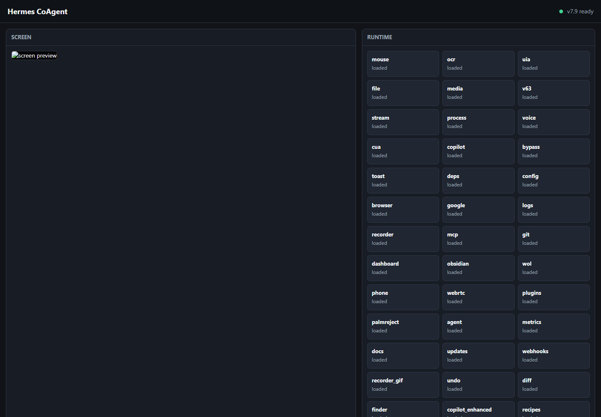

# Hermes CoAgent

[](https://github.com/Predator04/Hermes-CoAgent/actions/workflows/ci.yml)
[](https://github.com/Predator04/Hermes-CoAgent/stargazers)
[](LICENSE)
[](https://www.python.org/)

Hermes CoAgent is a local Windows desktop automation REST API server for agents and operator dashboards. It controls mouse, keyboard, screenshots, OCR, UI Automation, browser sessions, processes, windows, files, notifications, recipes, mobile remote control, and AI agent gateway workflows from one Flask service.



## Install

```bash
pip install hermes-coagent && hermes-coagent
```

For local development:

```bash
git clone https://github.com/Predator04/Hermes-CoAgent.git
cd Hermes-CoAgent
python -m pip install -r requirements.txt
python hermes_coagent.py --secure
```

`--secure` reads `./.token` or creates one automatically with a 64-character bearer token.

## Quickstart

```bash
# Start the server
python hermes_coagent.py --secure

# Confirm it is alive
curl http://127.0.0.1:9123/ping

# Read your generated token locally
TOKEN=$(cat .token)

# View capabilities
curl http://127.0.0.1:9123/version

# Move and click the mouse
curl -X POST http://127.0.0.1:9123/mouse/move \
  -H "Authorization: Bearer $TOKEN" \
  -H "Content-Type: application/json" \
  -d '{"x":960,"y":540}'

curl -X POST http://127.0.0.1:9123/mouse/click \
  -H "Authorization: Bearer $TOKEN" \
  -H "Content-Type: application/json" \
  -d '{"x":960,"y":540,"button":"left"}'

# Type text
curl -X POST http://127.0.0.1:9123/key/type \
  -H "Authorization: Bearer $TOKEN" \
  -H "Content-Type: application/json" \
  -d '{"text":"hello from Hermes"}'

# Get a screenshot
curl http://127.0.0.1:9123/screen/base64 \
  -H "Authorization: Bearer $TOKEN"
```

Open the dashboard at `http://127.0.0.1:9123/dashboard`. Full API documentation is available from `http://127.0.0.1:9123/help`.

## Features

| Area | What Hermes CoAgent exposes |
|---|---|
| 🖱️ Desktop control | Mouse move/click/drag/scroll, keyboard typing, hotkeys, action chains |
| 📸 Screen intelligence | JPEG/base64 screenshots, OCR, text finding, scene object model overlays |
| 🏗️ UI Automation | UIA trees, element lookup, element-indexed actions, window targeting |
| 🌐 Browser automation | Playwright-backed navigation, click, fill, extract, screenshot endpoints |
| ⚙️ System control | Process list/start/kill, window list/activate/move/resize, clipboard, power |
| 🤖 AI workflows | Copilot goal runner, agent gateway for Codex/Claude/Gemini/OpenCode CLIs |
| 🧩 Automation kits | Scheduled recipes, macro recording, GIF recording, undo, visual diff |
| 🩺 Reliability | Watchdog, endpoint health tracking, self-healing checks, dependency helper |
| 📱 Remote UI | Web dashboard, mobile remote view, SSE screen stream, notifications |
| 🔐 Local security | Bearer auth, CSRF helpers, rate limiting, local CORS, secret file ignores |

## Authentication

Run with `--secure` for bearer-token auth:

```bash
python hermes_coagent.py --secure
```

On first secure launch, Hermes creates `./.token` with `secrets.token_hex(32)`. Send it on protected requests:

```bash
curl http://127.0.0.1:9123/agent/status \
  -H "Authorization: Bearer $TOKEN"
```

Useful auth options:

| Option | Behavior |
|---|---|
| `--secure` | Enable auth using `./.token`, creating it if missing |
| `--token=KEY` | Start with an explicit token and save it locally |
| `HERMES_COAGENT_TOKEN` | Use a token from the environment |
| `--allow-external` | Bind to `0.0.0.0`; requires auth |

The token file is ignored by git. Do not expose port `9123` to untrusted networks.

## API Docs

`GET /help` returns the full endpoint catalog as JSON. Use `GET /help?format=text` for a terminal-friendly version.

Common endpoints:

| Method | Path | Purpose |
|---|---|---|
| `GET` | `/ping` | Liveness check |
| `GET` | `/version` | Version, modules, feature list |
| `GET` | `/dashboard` | Operator dashboard |
| `GET` | `/healer/status` | Self-healing status |
| `POST` | `/mouse/click` | Click at screen coordinates |
| `POST` | `/key/type` | Type text |
| `GET` | `/uia/tree` | Accessibility tree |
| `POST` | `/agent/exec` | Run an installed agent CLI |

## Docker

Docker packaging is planned. Hermes controls the native Windows desktop, so the supported launch path today is a local Windows Python process. A future image can still run syntax checks, docs generation, and non-desktop API tests.

Placeholder:

```bash
docker build -t hermes-coagent .
docker run --rm -p 9123:9123 hermes-coagent
```

## Development

```bash
python -m pip install -r requirements.txt
python test_compile.py
python hermes_coagent.py --secure
```

CI runs a syntax/compile smoke check on Python 3.11 and 3.12 across Windows and Ubuntu. Windows is the production runtime for desktop-control features.

See [CONTRIBUTING.md](CONTRIBUTING.md) for contribution workflow and [SECURITY.md](SECURITY.md) for security reporting.

## License

MIT. See [LICENSE](LICENSE).
